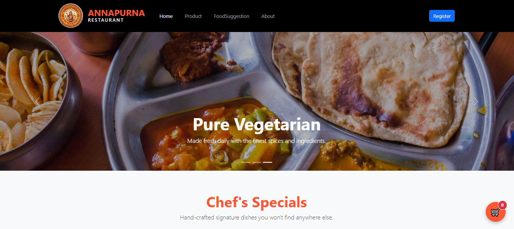
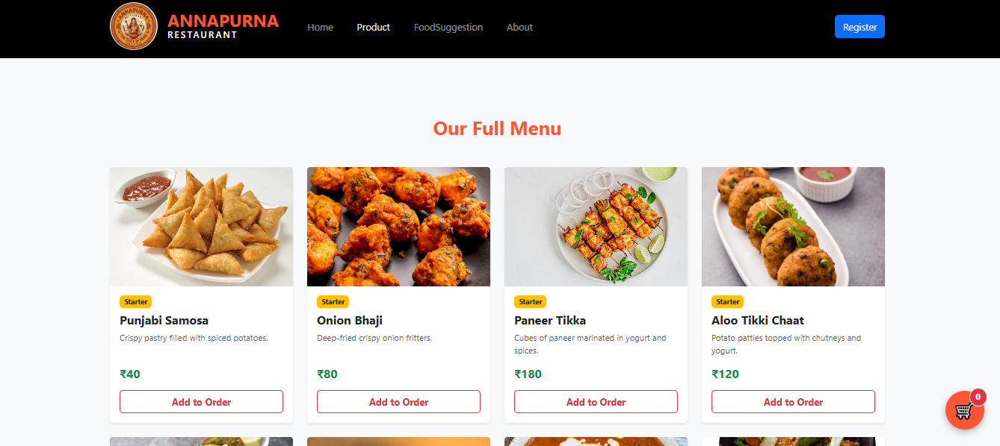
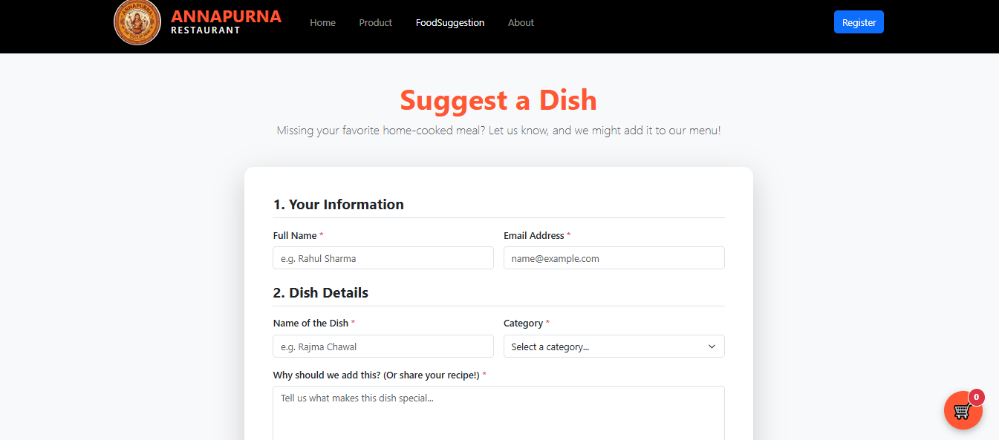
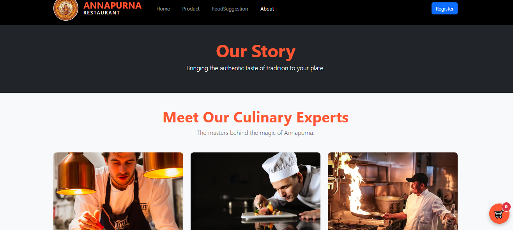

# 🍛 Annapurna Restaurant - Front-End Web Application

A fully responsive, interactive restaurant and food-delivery web application built using HTML5, Bootstrap 5, and Vanilla JavaScript. This project demonstrates dynamic DOM manipulation, form handling, and cross-page state management using the browser's `localStorage` API.

## ✨ Key Features

* **Dynamic Menu Generation:** The full menu is rendered dynamically using JavaScript arrays and template literals, making it highly scalable and easy to update.
* **Persistent Shopping Cart:** Utilizes `localStorage` to save the user's cart data. Users can add items, change quantities with `+` and `-` controls, and navigate between pages without losing their order.
* **Interactive UI/UX:** Features real-time price calculations, automated tax (GST) updates, and custom CSS animations (like the shaking cart icon when items are added).
* **Form Validation & Handling:** Includes functional UI for Registration, Login, and a "Food Suggestion" form (featuring file uploads and password-matching validation logic).
* **Multimedia Integration:** Seamlessly embeds responsive YouTube videos and interactive Google Maps iframes.
* **Mobile-First Design:** Built with Bootstrap 5 to ensure a flawless layout across desktops, tablets, and smartphones.

## 🛠️ Technologies Used

* **HTML5:** Semantic markup and structure.
* **CSS3 & Bootstrap 5.3.2:** Responsive grid system, flexbox utilities, and custom UI styling.
* **Vanilla JavaScript (ES6+):** DOM manipulation, event listeners, array methods (`find`, `findIndex`, `splice`), and JSON parsing.
* **Web Storage API:** `localStorage` for client-side data persistence.

## 📸 Screenshots

### Home Page

### Product Menu

### Food Suggestion Form

### About Us
